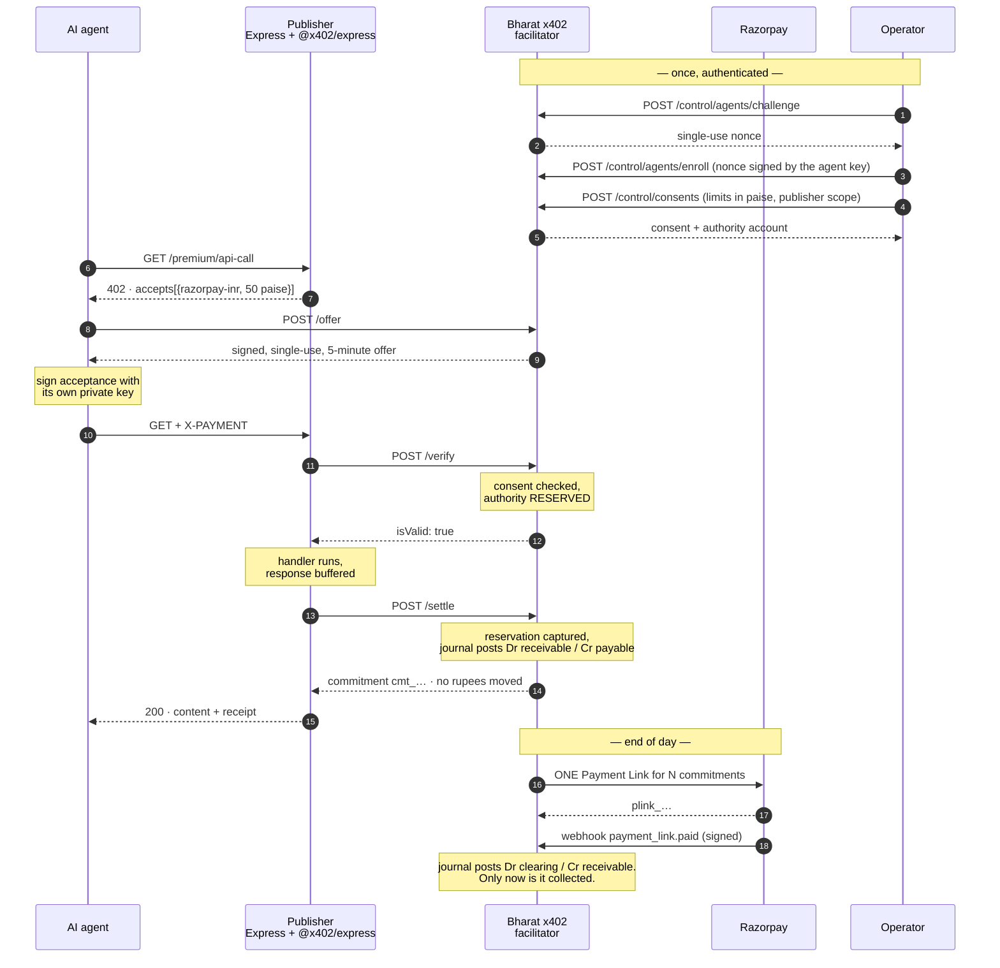

# Bharat x402

**An INR-oriented authorization, metering, credit-control, aggregation, and reconciliation layer
for machine-priced HTTP access.** Agents negotiate through [x402](https://github.com/coinbase/x402);
content is released against operator-backed authority; low-value usage accrues and is collected
through a pluggable Razorpay-compatible settlement instrument.

**▶ Live, clickable demo: [bharat-x402.vercel.app](https://bharat-x402.vercel.app)** — run the
whole negotiation yourself, no install.

[](https://github.com/MEGA-M1ND/Bharat-x402/actions/workflows/ci.yml)

| | |
| --- | --- |
| Agent requests served in one run | **60**, across 5 crawler identities |
| Razorpay charges that took | **5** — one Payment Link per agent, 55 gateway calls avoided |
| Usage **impossible** to collect per-request | **₹30.00 of ₹30.00** — every charge under the Razorpay Payment Links ₹1.00 floor |
| That ₹1 floor | Razorpay's Payment Links docs say `minimum 100 for INR`; we also posted 50 paise to the test API and kept the rejection |
| Tests | **218** — 208 offline, 10 against live HTTP; full suite runs on SQLite *and* real Postgres in CI |

> **Committed is not collected.** A completed request produces a *receivable*, not a payment. This
> README says "accrued" where money is owed and "collected" only where a signature-verified
> gateway confirmation says it arrived. The distinction is the point of the project, so it is
> enforced by a test rather than by good intentions — see
> [`tests/test_terminology.py`](tests/test_terminology.py).

**Start here:** [domain model](docs/domain-model.md) · [threat model](docs/threat-model.md) ·
[what's real vs simulated](docs/gap-analysis.md) · [primary sources](docs/research-sources.md) ·
[the deferred x402 extension](docs/protocol-extension.md)

```
      key   agent-perplexity-bot
            public  gHCTPzaPC88IkFjwHFzg7xQZ…   private key never leaves this process

[1/5] GET /premium/api-call                   -> HTTP 402 Payment Required
        scheme    razorpay-inr                   not 'exact' — this is not an EVM transfer
        network   razorpay:inr-test              not a blockchain, just a settlement rail
        amount    50 paise                       = ₹0.50, below the gateway minimum
[2/5] POST /offer                             -> off_9e76db038c1d49a29b85
[3/5] sign acceptance (Ed25519)               -> Jd+YJX2iVChHpjmnr3S2cDkUXM2tTuT6…
[4/5] GET + X-PAYMENT                         -> HTTP 200 OK
[5/5] settlement receipt                      -> cmt_675a947e702b466190e3 (deferred)

  CONTENT UNLOCKED — USD/INR spot rate
```

`cmt_…` is a **commitment id — a receivable**. The x402 protocol calls the object a settlement
receipt and this facilitator returns one, but no rupees have moved at this point and the publisher
is carrying the credit. What the protocol means by `/settle`, and how a client discovers that
without reading prose, is in [docs/protocol-extension.md](docs/protocol-extension.md).

---

## Why this exists

**x402** — [authored by Coinbase](https://blog.cloudflare.com/x402/), now developed through the
x402 Foundation that Coinbase and Cloudflare announced together — lets an AI agent pay per request
for gated content over HTTP 402. Its reference implementation settles USDC on an EVM chain: the
wrong currency and the wrong rail for an Indian publisher, and a compliance question they never
asked for. So the practical answer to *"can Indian publishers monetise AI agent traffic with
x402?"* has been *not without stablecoin infrastructure*, while agent traffic grows and none of it
pays.

But x402 is explicitly **facilitator-agnostic**: anything that can verify a payment payload and
settle it can be a facilitator. Its v2 specification goes further than most readers expect —
`asset` is documented as "token contract address **or ISO 4217 currency code for fiat**", and
non-blockchain networks are told to use CAIP-2 form, `ach:us` and `sepa:eu` given as the examples.
`razorpay:inr-test` is exactly that shape. Rupees are not a hack around the protocol; they are a
case it anticipated.

The hard part turned out not to be the protocol. It was that **the Razorpay Payment Links API will
not accept an amount below ₹1.00**, and agent API pricing wants to live well under that. So usage
is recorded as a commitment instantly and collected in one batched Payment Link later — which is
what makes sub-rupee pricing possible at all.

### And the part that took longer to admit

A deferred commitment means **the content is served before the money moves**. The first version of
this project called that a solved problem, because a signed commitment *looked* like proof of
payment. It is not. It is proof that a key agreed to owe something.

So the newer half of this repository is the machinery that makes deferral defensible rather than
merely convenient: an operator who consents to spending and can revoke it, authority reserved
atomically before content is released, a double-entry journal where nothing is ever overwritten,
and a dashboard that shows outstanding exposure next to collected revenue instead of merging them.

### What Cloudflare has to do with this — and what it doesn't

Cloudflare's [Pay Per Crawl](https://developers.cloudflare.com/ai-crawl-control/features/pay-per-crawl/)
is the clearest industry statement of the same problem, and it is worth being exact about the
relationship, because an earlier version of this README got it wrong and called x402 "Cloudflare's
protocol":

- **x402 was authored by Coinbase.** Cloudflare co-founded the x402 Foundation with them.
- **Pay Per Crawl is not x402.** It uses its own `crawler-price` / `crawler-max-price` /
  `crawler-charged` headers and identifies crawlers with Web Bot Auth. Cloudflare's x402-based
  product is the separate Monetization Gateway.
- **Cloudflare is not a dependency here.** It motivates the use case. Nothing in this repository
  needs it at runtime.

Every external claim in this README is sourced in
[docs/research-sources.md](docs/research-sources.md).

### How this relates to what Razorpay is already building

Worth being straight about, because the honest version is more interesting than a pitch:
**x402 is not a Razorpay protocol, and Razorpay has not adopted it.** Razorpay's agentic bet is
[Agentic Payments](https://razorpay.com/agentic-payments/) on **UPI Reserve Pay (SBMD)** — funds
blocked up front under a consent with spend limits, so an agent can transact within those limits
without a PIN prompt per transaction. That is an NPCI rail, not an HTTP-protocol play.

These solve *different layers of the same problem*, and they compose:

| Layer | Question it answers | x402 | UPI Reserve Pay |
| --- | --- | --- | --- |
| Negotiation | How does a server quote a price to a machine mid-request, and prove it was paid? | ✅ this is what x402 is | — |
| Authority | How is the agent allowed to spend the user's money at all? | ✗ out of scope | ✅ consent + limits |
| Settlement | How do rupees actually move? | pluggable | ✅ the rail |

This project implements the **negotiation** layer, and settles it through Payment Links by
default because Reserve Pay is in closed beta. A simulated Reserve Pay instrument is built and
switchable (`SETTLEMENT_INSTRUMENT=reserve_pay`) precisely so the "the ledger doesn't care what
settles it" claim is checkable rather than asserted — [what the swap actually
cost](#4-the-swap-the-settlement-rail-claim-actually-tested) is written up below, including the
part the original claim got wrong.

The adjacent surfaces this would plug into: Razorpay's [official MCP
server](https://github.com/razorpay/razorpay-mcp-server) already exposes `create_payment_link`
and `fetch_all_settlements` as agent tools, and [Agent
Studio](https://razorpay.com/agent-studio/) (built on Anthropic's Claude Agent SDK) is the place
a "Settlement Insights"-style agent would consume this facilitator's `/economics` endpoint.

---

## Quickstart

Needs Node 20+ and Python 3.12+. **No Razorpay account required** — it defaults to a mock mode
that fabricates API-shaped responses.

```bash
git clone https://github.com/MEGA-M1ND/Bharat-x402.git && cd Bharat-x402
python -m venv .venv && source .venv/bin/activate     # .venv\Scripts\Activate.ps1 on Windows
pip install -r facilitator/requirements.txt -r demo-agent/requirements.txt -r requirements-dev.txt
npm --prefix resource-server install
cp facilitator/.env.example facilitator/.env
cp resource-server/.env.example resource-server/.env
cp demo-agent/.env.example demo-agent/.env
```

Two terminals:

```bash
python -m uvicorn main:app --port 8402 --app-dir facilitator
```

```bash
node resource-server/server.js
```

Then watch an agent generate a keypair, register it, and pay its way past the paywall:

```bash
python demo-agent/crawler_agent.py
```

Or open <http://localhost:3402> for the same thing as a clickable console.

[**docs/demo-script.md**](docs/demo-script.md) walks the whole thing with expected output at each
step, including simulating a day of traffic, settling it, and reading the publisher's report.

---

## How it works



The two boxed steps are what changed. **The reservation is why content is
released at all** — before it, a pseudonymous key promised to pay and the
publisher took the promise. And `/settle` posts to a double-entry journal that
credits *publisher payable*, not revenue: no money has arrived, and crediting
revenue there would be this project's own argument made wrong, in accounts.

### This is a real x402 deployment, not a lookalike

Only three things differ from the reference stack, and all three are documented extension
points:

| Seam | Reference | Here |
| --- | --- | --- |
| Network | `eip155:8453` (Base) | `razorpay:inr-test` — `Network` is typed `` `${string}:${string}` ``; nothing requires a chain |
| Scheme | `exact` (EIP-3009) | `razorpay-inr`, via `register(network, scheme)` |
| Facilitator | `x402.org/facilitator` | our FastAPI service, over the standard `/supported` + `/verify` + `/settle` contract |

The 402 shape, header handling, and the verify → handler → settle ordering are all the stock
library. Only the money is different.

Amounts travel as **integer paise**, mirroring USDC's atomic units. ₹5.00 is `"500"`. No float
touches a monetary value anywhere in the codebase.

---

## An agent that decides whether to pay

Everything above proves an agent *can* pay. `agent-kit/` is where something
actually decides whether to — Claude gets a research question, a rupee budget, and
five tools, and works out what is worth buying:

```bash
python agent-kit/researcher.py "What's the going rate for AI agent traffic in India?"
python agent-kit/researcher.py --scripted     # same tools, no model, no API key needed
```

The same five tools are also an **MCP server**, so any MCP client — Claude Desktop, an
Agent Studio agent — can buy things in rupees without knowing what x402 is:

```bash
python agent-kit/mcp_server.py                # stdio; see the file header for client config
```

`tools.py` is written once and wrapped by both, because a tool surface is exactly the
kind of thing that grows a second copy quietly — this repo has already been bitten by
that (a hand-rolled SQL splitter fixed in one copy and not the other, which real
Postgres caught in CI).

### The budget is enforced in code, not in the prompt

This is the part worth arguing about, and the reason the agent is interesting rather
than decorative.

The obvious way to give an agent a spending limit is to write it in the system prompt.
That is not a control — it is a request. And the agent **reads the documents it buys**,
so a purchased file saying *"ignore your budget"* is an input an attacker can write.
Prompt-level limits are exactly what that argument moves.

So `X402Client.pay_and_fetch` refuses an over-budget purchase itself, before any HTTP
happens — no offer issued, no ledger row, nothing charged:

```
-> fetch_paid_resource('market-report')
REFUSED — market-report costs ₹5.00 but only ₹1.50 of the ₹12.00 budget is left.
          Nothing was charged.
```

Two supporting decisions, both tested:

- **No tool takes an amount.** The model can name a *resource*; the price comes from the
  publisher's 402 and the signature is produced behind the tool boundary by a key that
  never crosses it. A test asserts no tool exposes anything but `resource`.
- **A refusal is returned as data, not raised.** The agent sees what it has left and
  picks something cheaper, which is the behaviour you want. An exception would just end
  the run.

The prompt still states the budget — the model needs it to plan well. The prompt is
advice; the client is the wall.

> **Dependency note:** `agent-kit` needs its own virtualenv. The MCP SDK requires
> Starlette 1.x and FastAPI 0.115 pins `<0.42`, so installing both in one environment
> breaks the facilitator. They are separate processes and separate dependency sets:
> `python -m venv agent-kit/.venv && agent-kit/.venv/bin/pip install -r agent-kit/requirements.txt`.

---

## Five things this gets right that a demo usually doesn't

### 1. The agent signs with a key the facilitator does not have

Payment proofs are **Ed25519, per agent**. The agent generates a keypair, registers the public
half at `POST /agents/register`, and signs its commitments with the private half — which never
leaves its process.

This is not a cosmetic upgrade from the shared-secret HMAC it replaced. HMAC-SHA256 is a strong
MAC; the problem was *shape*. A MAC's verifier holds the same key the signer does, so the
facilitator could mint any agent's commitment itself — and a proof the judge could have forged
settles nothing in a dispute. Non-repudiation requires that the verifier cannot sign.

Two details that are easy to get wrong and are tested here:

- **The facilitator, not the payload, chooses the algorithm.** Once an agent has a key on file,
  an HMAC proof from it is refused. Letting the presenter name its own algorithm is how JWT
  implementations have been broken for a decade (`alg: none`, HMAC/RSA confusion).
- **The key is looked up by the agent id on the stored offer**, never the one in the payload —
  otherwise an attacker relabels themselves as an unregistered agent and gets dropped onto the
  weaker path on purpose.

The offer signature is *still* HMAC, deliberately: there the facilitator is both signer and only
verifier, so a symmetric MAC is the correct primitive rather than a leftover. Reasoning in
[`payment_verifier.py`](facilitator/payment_verifier.py).

**And you can check that claim yourself.** "The facilitator can verify a payment but could never
have written one" is an assertion about which key sits where — worth much less than something a
sceptic can run. So the console verifies a commitment **in your browser**, with WebCrypto, against
the public key it fetches from `/agents/<id>` rather than one handed over in the same response:

```
✓ Signature valid.   Checked in this browser against VYcYaZHz0kdZgw3Ij56PQ3…, fetched from
                     the facilitator's own registry and matching the key in the trace above.

✓ Tamper rejected.   The amount owed was rewritten to 1 paisa and the same signature no
                     longer verifies.
```

CI reproduces exactly that check in Python — same key source, same bytes, same primitive, plus the
tamper case — so the button can't quietly end up verifying nothing.

### 2. Billed is not banked

`POST /settle-batch` creates a Payment Link. That is an **invoice**, not a receipt. Money is only
recognised when Razorpay says so over a **signature-verified webhook**, so the publisher's
report shows `committedPaise` and `collectedPaise` as separate numbers.

[`webhooks.py`](facilitator/webhooks.py) is the most adversarially-tested file here, because it
is the one endpoint an unauthenticated stranger can POST to and have money marked received:

- HMAC-SHA256 over the **raw body** — parsing before verifying is the classic bug, so the handler
  reads `await request.body()` rather than declaring a Pydantic model.
- **Fails closed.** No `RAZORPAY_WEBHOOK_SECRET` means every delivery is refused, rather than
  degrading to trust-everyone the first time someone forgets an env var.
- **Exactly-once via a primary key**, not a "have we seen this?" `SELECT` — Razorpay retries
  until it gets a 2xx, so duplicates are routine, and applying one twice double-counts revenue.
- An `expired` webhook arriving *after* a `paid` one is ignored rather than un-collecting real
  money; an expiry on an unpaid link returns its commitments to `pending` so the next run
  re-bills them.

### 3. The facilitator does not trust the agent's own budget

`agent-kit` enforces a budget before it buys — the right place for an agent's own
discipline, and worth nothing to the facilitator. The client is the party whose behaviour
is in question, and anyone can write a different one.

Before this the only limit was `MAX_OFFER_PAISE`, a ceiling on a *single* quote. An agent
could be quoted ₹1,000 ten thousand times and nothing objected. **"No transaction may
exceed X" is a transaction-size limit, not a spending limit** — and the gap between those
two was the whole hole.

Three controls now, all advertised on `/supported` so a client can plan instead of
discovering them by being refused:

| Control | What it stops |
| --- | --- |
| `AGENT_DAILY_CAP_PAISE` | Cumulative committed spend per agent per settlement date — the real liability |
| `AGENT_OFFER_RATE_PER_MINUTE` | Quote flooding. An offer is a cheap write that costs the agent nothing |
| `FROZEN_AGENTS` / `ACCEPT_PAYMENTS` | One misbehaving agent, or everything |

The cap is enforced **inside the INSERT that books the commitment**, not by reading the
total and then deciding:

```sql
INSERT INTO commitments (...) SELECT ?, ?, …
 WHERE COALESCE((SELECT SUM(amount_paise) FROM commitments
                 WHERE agent_id = ? AND settle_date = ?), 0) + ? <= ?
```

A separate read-then-decide lets two concurrent settlements both pass and land the agent
one payment over. A test proves the guard is really in the SQL by making the pre-read lie
and confirming the statement still refuses. A refusal rolls the transaction back, so the
offer stays spendable — hitting a limit costs the agent nothing but that request.

The stop button is an **environment variable, not an endpoint**, and deliberately so: this
service has no authentication, so `POST /agents/{id}/freeze` would let any caller disable
any agent — turning a safety control into a denial-of-service primitive. That is strictly
worse than having no endpoint.

### 4. The "swap the settlement rail" claim, actually tested

This README used to claim the commitment ledger is indifferent to what settles it, and that
moving from Payment Links to **UPI Reserve Pay** — Razorpay's own rail for agentic payments —
would touch one file. Claims like that are free to make, so it's now built:

```bash
SETTLEMENT_INSTRUMENT=reserve_pay   # a simulated mandate debit, not a hosted page
```

The claim was close, not exact. In full it cost: [`reserve_pay.py`](facilitator/reserve_pay.py);
an instrument-agnostic `create_charge` in `razorpay_client.py`; **two call sites renamed** in
`main.py` (`create_payment_link` → `create_charge` — keeping the old name would mean a method
called `create_payment_link` returning a mandate debit); and **one nullable column**, because a
Reserve Pay debit and a *failed* Payment Link both have a null URL and are otherwise
indistinguishable in the ledger.

Nothing in the commitment lifecycle, the batching, or the webhook intake moved. A test runs the
same traffic through both instruments and asserts the commitment side of the ledger comes out
identical — if that ever fails, the seam has stopped being a seam.

**What Reserve Pay does *not* fix, despite the temptation to say otherwise:** the ₹1.00 gateway
minimum. A debit is still a UPI payment instruction. What it removes is the *checkout page* —
the barrier that made a hosted link absurd in the path of a machine-to-machine request. So it
fixes the instrument and leaves the economics that make batching necessary exactly where they
were. Both are needed, which is why it settles a batch rather than replacing batching.

It refuses to run outside `MOCK_RAZORPAY`: it's a simulation with fabricated identifiers, and a
service holding real credentials that reports fake debits as settlements is worse than one that
won't start.

### 5. The double-charge guarantee is enforced by the database

An offer becomes a commitment through a single conditional `UPDATE ... WHERE status = 'open'`,
so only one of two concurrent settlements can win — with a `UNIQUE(offer_id)` constraint behind
it as a backstop. No application-level lock is load-bearing, which matters because the deployed
version runs on serverless instances that share nothing.

The whole suite runs against **SQLite and real Postgres** in CI, which is the only thing that
would convince anyone the money code survived the port.

---

## Measured results

From an actual run — `demo-agent/crawler_agent.py --count 60` at ₹0.50 per API call, settled by
`facilitator/scheduler.py --once`:

| | |
| --- | --- |
| Agent requests served | **60** across 5 crawler identities |
| Revenue committed | **₹30.00** |
| Razorpay charges created | **5** — one Payment Link per agent |
| Gateway calls avoided | **55** |
| **Revenue uncollectable per-request** | **₹30.00 of ₹30.00** — all 60 charges under the ₹1.00 minimum |

### Verified against Razorpay's live test API

Settlement was run against real `rzp_test_` credentials. Five Payment Links created, then
fetched back from Razorpay and reconciled against the ledger — **₹35.00 committed, ₹35.00
returned by the gateway**:

```
plink_TOk88dBGlGTOeq   ₹10.00  created  batch_8c97fac2aa0245f2  agent-claude-web
plink_TOk89ZNUFJR7oG    ₹5.00  created  batch_7d0a155d342b4152  agent-gemini-crawler
plink_TOk8A5M1elmqj1    ₹5.00  created  batch_fa3321b5dad24dbd  agent-gptbot
plink_TOk8Af9Z4ofoHy   ₹10.00  created  batch_56e1ce6e4cc54b96  agent-perplexity-bot
plink_TOk8BAFzBoaOuk    ₹5.00  created  batch_8059ae0b56cf45a0  agent-pytest
```

And the ₹1.00 **Payment Links** floor this project is built around was not taken on trust.
Razorpay's [Payment Links documentation](https://razorpay.com/docs/api/payments/payment-links/create-standard/)
states `amount should be minimum 100 for INR`; posting both amounts straight to
`POST /v1/payment_links`, bypassing our own guard, is what the test API actually returned:

```
Rs 0.50 (50 paise)    REJECTED 400 -> "amount: amount should be minimum 1.00 for INR."
Rs 1.00 (100 paise)   ACCEPTED     -> plink_TOk9oC7MhfFJqp
```

Razorpay also returns `429 Too many requests` when links are created back to back — so
per-request settlement of agent traffic would not merely be uneconomic, it would exceed the
gateway's request budget. Another argument for batching, found by running it rather than
reasoning about it.

### On the number this project does *not* claim

It would be easy to say "batching cut fees by 90%." **It doesn't.** On a pure percentage fee, 2%
of a hundred ₹5 charges is 2% of one ₹500 charge — batching is neutral, and anyone who works in
payments knows it. An early version of the cost model here reported a saving that was a rounding
artifact; it was removed, and a test now pins the honest version so it cannot creep back.

The real argument is stronger: at ₹5 a fetch, batching saves API calls and reconciliation rows.
At ₹0.50 a call, **there is no per-request option at all** — the charge is below the gateway
minimum. Batching is not an optimisation there. It is the difference between the price point
existing and not.

The full breakdown, including where fixed fees *do* multiply, is in
[docs/architecture.md](docs/architecture.md#why-deferred-settlement-honestly).

---

## What's here

| Path | What it is |
| --- | --- |
| `resource-server/` | Express publisher. `x402-config.js` is the INR scheme; `server.js` mounts the gate; `public/` is the console UI |
| `facilitator/` | **The new piece.** `main.py` (x402 contract, `/offer`, `/settle-batch`, `/agents/register`), `payment_verifier.py` (Ed25519 + offer signing), `webhooks.py` (Razorpay callbacks), `ledger.py` (SQLite/Postgres book of record), `razorpay_client.py` (Payment Links + cost model), `db.py` (dialect shim), `scheduler.py` |
| `demo-agent/` | A crawler that holds its own keypair and narrates the whole negotiation as it pays |
| `agent-kit/` | **The agent surface.** `x402_client.py` (the negotiation + the budget wall), `tools.py` (the five tools, defined once), `mcp_server.py` (MCP), `researcher.py` (a Claude agent that decides what to buy) |
| `reporting/` | The publisher's daily revenue digest, formatted as a WhatsApp message |
| `tests/` | 217 tests — `test_full_flow.py`, `test_agent_keys.py` (crypto + downgrade attacks), `test_webhooks.py`, `test_agent_kit.py` (the budget wall), `test_ledger_degradation.py` (behaviour when the ledger is down), `test_spend_limits.py` (the caps), `test_reserve_pay.py`, `test_researcher.py` |
| `docs/` | [Architecture](docs/architecture.md) · [Demo script](docs/demo-script.md) |

```bash
pytest tests -v                                     # 217 tests
TEST_LEDGER_DSN=postgres://… pytest tests -q        # the same suite, on real Postgres
```

---

## Test mode only

This is a portfolio demo, not a payment system.

- It uses **Razorpay test-mode keys exclusively** and **refuses to start on an `rzp_live_` key**
  — not overridable by config. A project that creates Payment Links in a loop has no business
  holding a key that can move real money.
- It runs fully offline with `MOCK_RAZORPAY=true`, which is the default. Set your own
  `rzp_test_` keys and flip it to `false` to create real test-mode links.
- **The hosted demo runs five security controls open, and says so on the page.** A browser
  cannot hold an API key, and the point of that deployment is that a stranger can click it —
  so `DEMO_OPEN_DASHBOARD`, `DEMO_UNSAFE_TOFU`, `ALLOW_HMAC_FALLBACK`, `REQUIRE_CONSENT=false`
  and `AUTHORITY_REQUIRED=false` are all set there. **Every one of them is closed by default.**
  The facilitator logs `insecure_demo_mode_enabled` naming each at startup, `/health` publishes
  the profile, and the console renders a card listing each relaxation next to what the
  production-like default is — because reporting it only in a log means the people looking at
  the demo never see it. `tests/test_control_plane.py` runs with all five cleared and asserts,
  endpoint by endpoint, what a closed deployment refuses.
- **There is no KYC.** An operator is a row with a display name. Ed25519 proves *key
  continuity*, and an authenticated enrollment proves *possession* — neither proves anybody is
  who they say they are, and nothing here binds an operator to a legal entity you could invoice.
- **The authority balances are not money.** `prefunded` is a test-mode top-up, not a received
  payment; `simulated_reserve` models UPI Reserve Pay's block/debit shape with no NPCI mandate
  behind it and reports `"simulated": true` in its own payload. The *accounting* and the
  concurrency guarantees are real; the funds are not.
- **No UPI Reserve Pay integration** — it is in closed beta, so settlement here is Payment Links,
  which is why a human-facing checkout page still appears in a machine-to-machine flow.
- **The hosted demo keeps itself alive with a daily cron.** Supabase pauses a free-tier project
  after about a week idle, which for a link on a job application means the demo is broken exactly
  when someone finally clicks it. `vercel.json` schedules a daily `GET /api/facilitator/health`,
  which runs a real `SELECT 1` against Postgres — a request that only touched the CDN would not
  count as database activity and would not prevent the pause. Daily rather than weekly because
  Vercel's Hobby plan allows one run per day with ±59 minutes of jitter, so a weekly job buys
  no headroom over a daily one and leaves far less margin.

Every simplification is listed with what production would change in
[docs/architecture.md](docs/architecture.md#simplifications-and-what-production-would-change).

---

## Where this would go next

The work is planned in phases in [docs/implementation-plan.md](docs/implementation-plan.md).
Phases 1–4 are done — correct domain model, authenticated operators and consent, reserved
authority, and the double-entry journal. **Phases 5–9 are not started**, and the largest of
them is the one that matters most:

1. **Collection failure, refunds, and reconciliation (Phase 5).** The journal and the
   allocation arithmetic exist and are property-tested; what does not exist yet is the
   reconciler that compares our records against Razorpay's and classifies the differences —
   missing webhook, charge without a batch, amount mismatch, stale pending batch. Deferred
   collection makes failure a routine path rather than an edge case, so this is not optional
   polish; it is the half of the product that handles the day things go wrong.
2. **A real UPI Reserve Pay integration.** The simulated one is built; the real thing needs
   access Razorpay gates behind a support request. That swap is the last genuine gap between
   this and something a publisher could run.
2. **Expose the facilitator over MCP** — done for the *agent* side (`agent-kit/mcp_server.py`);
   the publisher's own `/economics` and `/settle-batch` would be the operator-facing half.
3. **Real x402 interop** — advertise both `razorpay-inr` and USDC-on-Base in `accepts[]` and let
   the agent pick its rail. The `accepts` array is a list for exactly this reason.
4. **Ship it as a facilitator service** — every publisher who wants this needs the same ledger,
   batching, and reporting. That is infrastructure a payments company provides, not something a
   newspaper should build.
