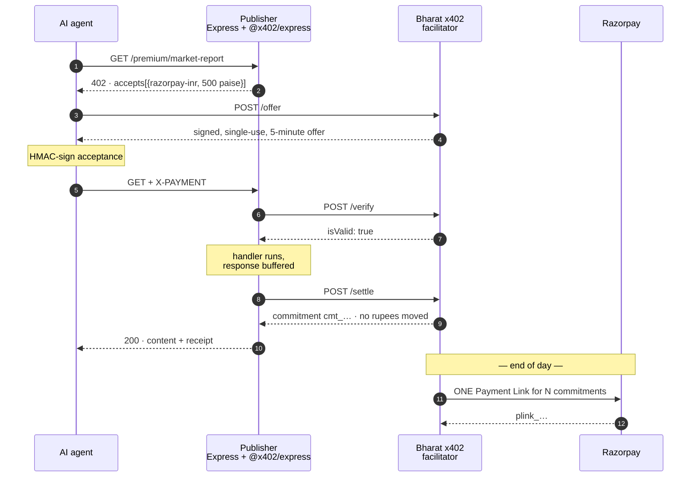

# Bharat x402

**An INR settlement facilitator for Cloudflare's x402 agent-payment protocol** — so Indian
publishers can charge AI crawlers per request in rupees, through Razorpay, without touching
stablecoin infrastructure.

[](https://github.com/MEGA-M1ND/Bharat-x402/actions/workflows/ci.yml)

```
[1/5] GET /premium/market-report              -> HTTP 402 Payment Required
        scheme    razorpay-inr                   not 'exact' — this is not an EVM transfer
        network   razorpay:inr-test              not a blockchain, just a settlement rail
        amount    500 paise                      = ₹5.00
[2/5] POST /offer                             -> off_9e76db038c1d49a29b85
[3/5] sign acceptance (HMAC-SHA256)           -> bbc46770994d770435254cd…
[4/5] GET + X-PAYMENT                         -> HTTP 200 OK
[5/5] settlement receipt                      -> cmt_675a947e702b466190e3 (deferred)

  CONTENT UNLOCKED — India Digital Payments Market Report, August 2026
```

---

## Why this exists

x402 lets an AI agent pay per request for gated content over HTTP 402. Its reference
implementation settles USDC on an EVM chain — the wrong currency and the wrong rail for an
Indian publisher, and a compliance question they never asked for. So the practical answer to
*"can Indian publishers monetise AI crawler traffic with x402?"* has been *not without
stablecoin infrastructure*, while agent traffic grows and none of it pays.

But x402 is explicitly **facilitator-agnostic**: anything that can verify a payment payload
and settle it can be a facilitator. This is that, for rupees. The publisher runs the stock
`@x402/express` middleware, unmodified, and gets paid in INR.

The hard part turned out not to be the protocol. It was that **Razorpay will not process an
order below ₹1.00**, and agent API pricing wants to live well under that. So payments are
recorded as commitments instantly and settled in one batched Payment Link later — which is
what makes sub-rupee pricing possible at all.

---

## Quickstart

Needs Node 20+ and Python 3.12+. **No Razorpay account required** — it defaults to a mock
mode that fabricates API-shaped responses.

```bash
git clone https://github.com/MEGA-M1ND/Bharat-x402.git && cd Bharat-x402
python -m venv .venv && source .venv/bin/activate     # .venv\Scripts\Activate.ps1 on Windows
pip install -r facilitator/requirements.txt -r demo-agent/requirements.txt -r requirements-dev.txt
npm --prefix resource-server install
cp facilitator/.env.example facilitator/.env
cp resource-server/.env.example resource-server/.env
cp demo-agent/.env.example demo-agent/.env
```

Two terminals:

```bash
python -m uvicorn main:app --port 8402 --app-dir facilitator
```

```bash
node resource-server/server.js
```

Then watch an agent pay its way past the paywall:

```bash
python demo-agent/crawler_agent.py
```

[**docs/demo-script.md**](docs/demo-script.md) walks the whole thing with expected output at
each step, including simulating a day of traffic, settling it, and reading the publisher's
report.

---

## How it works



### This is a real x402 deployment, not a lookalike

Only three things differ from the reference stack, and all three are documented extension
points:

| Seam | Reference | Here |
| --- | --- | --- |
| Network | `eip155:8453` (Base) | `razorpay:inr-test` — `Network` is typed `` `${string}:${string}` ``; nothing requires a chain |
| Scheme | `exact` (EIP-3009) | `razorpay-inr`, via `register(network, scheme)` |
| Facilitator | `x402.org/facilitator` | our FastAPI service, over the standard `/supported` + `/verify` + `/settle` contract |

The 402 shape, header handling, and the verify → handler → settle ordering are all the stock
library. Only the money is different.

Amounts travel as **integer paise**, mirroring USDC's atomic units. ₹5.00 is `"500"`. No
float touches a monetary value anywhere in the codebase.

---

## Measured results

From an actual run — `demo-agent/crawler_agent.py --count 60` at ₹0.50 per API call, settled
by `facilitator/scheduler.py --once`:

| | |
| --- | --- |
| Agent requests served | **60** across 5 crawler identities |
| Revenue committed | **₹30.00** |
| Razorpay charges created | **5** — one Payment Link per agent |
| Gateway calls avoided | **55** |
| **Revenue uncollectable per-request** | **₹30.00 of ₹30.00** — all 60 charges under the ₹1.00 minimum |

### Verified against Razorpay's live test API

Settlement was run against real `rzp_test_` credentials. Five Payment Links created, then
fetched back from Razorpay and reconciled against the ledger — **₹35.00 committed, ₹35.00
returned by the gateway**:

```
plink_TOk88dBGlGTOeq   ₹10.00  created  batch_8c97fac2aa0245f2  agent-claude-web
plink_TOk89ZNUFJR7oG    ₹5.00  created  batch_7d0a155d342b4152  agent-gemini-crawler
plink_TOk8A5M1elmqj1    ₹5.00  created  batch_fa3321b5dad24dbd  agent-gptbot
plink_TOk8Af9Z4ofoHy   ₹10.00  created  batch_56e1ce6e4cc54b96  agent-perplexity-bot
plink_TOk8BAFzBoaOuk    ₹5.00  created  batch_8059ae0b56cf45a0  agent-pytest
```

And the ₹1.00 floor this project is built around is not taken from documentation. Posting
both amounts straight to `POST /v1/payment_links`, bypassing our own guard:

```
Rs 0.50 (50 paise)    REJECTED 400 -> "amount: amount should be minimum 1.00 for INR."
Rs 1.00 (100 paise)   ACCEPTED     -> plink_TOk9oC7MhfFJqp
```

Razorpay also returns `429 Too many requests` when links are created back to back — so
per-request settlement of agent traffic would not merely be uneconomic, it would exceed the
gateway's request budget. Another argument for batching, found by running it rather than
reasoning about it.

### On the number this project does *not* claim

It would be easy to say "batching cut fees by 90%." **It doesn't.** On a pure percentage fee,
2% of a hundred ₹5 charges is 2% of one ₹500 charge — batching is neutral, and anyone who
works in payments knows it. An early version of the cost model here reported a saving that
was a rounding artifact; it was removed, and a test now pins the honest version so it cannot
creep back.

The real argument is stronger: at ₹5 a fetch, batching saves API calls and reconciliation
rows. At ₹0.50 a call, **there is no per-request option at all** — the charge is below the
gateway minimum. Batching is not an optimisation there. It is the difference between the
price point existing and not.

The full breakdown, including where fixed fees *do* multiply, is in
[docs/architecture.md](docs/architecture.md#why-deferred-settlement-honestly).

---

## What's here

| Path | What it is |
| --- | --- |
| `resource-server/` | Express publisher. `x402-config.js` is the INR scheme; `server.js` mounts the gate |
| `facilitator/` | **The new piece.** `main.py` (x402 contract + `/offer` + `/settle-batch`), `payment_verifier.py` (signing), `ledger.py` (SQLite book of record), `razorpay_client.py` (Payment Links + cost model), `scheduler.py` |
| `demo-agent/` | A crawler that narrates the whole negotiation as it pays |
| `reporting/` | The publisher's daily revenue digest, formatted as a WhatsApp message |
| `tests/` | 60 tests — unit, service-level, and integration against live HTTP |
| `docs/` | [Architecture](docs/architecture.md) · [Demo script](docs/demo-script.md) |

```bash
pytest tests -v        # 60 passed
```

---

## Test mode only

This is a portfolio demo, not a payment system.

- It uses **Razorpay test-mode keys exclusively** and **refuses to start on an `rzp_live_`
  key** — not overridable by config. A project that creates Payment Links in a loop has no
  business holding a key that can move real money.
- It runs fully offline with `MOCK_RAZORPAY=true`, which is the default. Set your own
  `rzp_test_` keys and flip it to `false` to create real test-mode links.
- **No webhook handling.** Links are created and reconciled, but a link that is actually
  *paid* does not update the ledger — production needs a `payment_link.paid` webhook.
- Payment proofs use **HMAC with a shared secret**, not per-agent keypairs. That is a real
  downgrade from x402's EIP-3009 signatures — there is no non-repudiation, since the
  facilitator holds the key it verifies with. It is documented at the top of
  `payment_verifier.py` rather than papered over.

Every simplification is listed with what production would change in
[docs/architecture.md](docs/architecture.md#simplifications-and-what-production-would-change).

---

## Where this would go next

1. **Real x402 interop** — advertise both `razorpay-inr` and USDC-on-Base in `accepts[]` and
   let the agent pick its rail. The `accepts` array is a list for exactly this reason.
2. **UPI Autopay instead of Payment Links** — a mandate debits the agent operator directly,
   removing the hosted checkout page a machine cannot use. The commitment ledger is
   indifferent to what settles it; this touches one file.
3. **Ship it as a facilitator service** — every publisher who wants this needs the same
   ledger, batching, and reporting. That is infrastructure a payments company provides, not
   something a newspaper should build.
