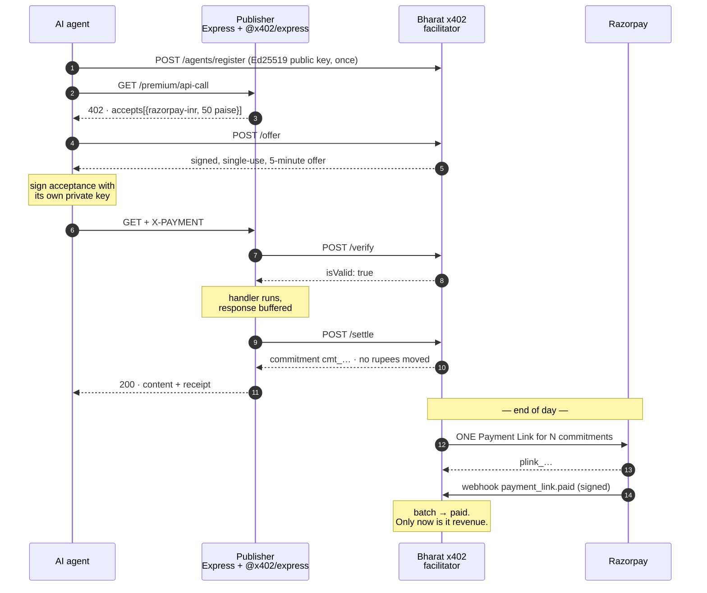

# Bharat x402

**An INR settlement facilitator for the x402 agent-payment protocol** — so Indian publishers can
charge AI agents per request in rupees, through Razorpay, without touching stablecoin
infrastructure.

**▶ Live, clickable demo: [bharat-x402.vercel.app](https://bharat-x402.vercel.app)** — run the
whole negotiation yourself, no install.

[](https://github.com/MEGA-M1ND/Bharat-x402/actions/workflows/ci.yml)

| | |
| --- | --- |
| Agent requests served in one run | **60**, across 5 crawler identities |
| Razorpay charges that took | **5** — one Payment Link per agent, 55 gateway calls avoided |
| Revenue **impossible** to collect per-request | **₹30.00 of ₹30.00** — every charge under Razorpay's ₹1.00 floor |
| Razorpay's ₹1 floor | verified by posting 50 paise to the live test API, not read off a doc |
| Tests | **132** — 122 offline, 10 against live HTTP; full suite runs on SQLite *and* real Postgres in CI |

```
      key   agent-perplexity-bot
            public  gHCTPzaPC88IkFjwHFzg7xQZ…   private key never leaves this process

[1/5] GET /premium/api-call                   -> HTTP 402 Payment Required
        scheme    razorpay-inr                   not 'exact' — this is not an EVM transfer
        network   razorpay:inr-test              not a blockchain, just a settlement rail
        amount    50 paise                       = ₹0.50, below the gateway minimum
[2/5] POST /offer                             -> off_9e76db038c1d49a29b85
[3/5] sign acceptance (Ed25519)               -> Jd+YJX2iVChHpjmnr3S2cDkUXM2tTuT6…
[4/5] GET + X-PAYMENT                         -> HTTP 200 OK
[5/5] settlement receipt                      -> cmt_675a947e702b466190e3 (deferred)

  CONTENT UNLOCKED — USD/INR spot rate
```

---

## Why this exists

x402 lets an AI agent pay per request for gated content over HTTP 402. Its reference
implementation settles USDC on an EVM chain — the wrong currency and the wrong rail for an
Indian publisher, and a compliance question they never asked for. So the practical answer to
*"can Indian publishers monetise AI agent traffic with x402?"* has been *not without stablecoin
infrastructure*, while agent traffic grows and none of it pays.

But x402 is explicitly **facilitator-agnostic**: anything that can verify a payment payload and
settle it can be a facilitator. This is that, for rupees. The publisher runs the stock
`@x402/express` middleware, unmodified, and gets paid in INR.

The hard part turned out not to be the protocol. It was that **Razorpay will not process an
order below ₹1.00**, and agent API pricing wants to live well under that. So payments are
recorded as commitments instantly and settled in one batched Payment Link later — which is what
makes sub-rupee pricing possible at all.

### How this relates to what Razorpay is already building

Worth being straight about, because the honest version is more interesting than a pitch:
**x402 is not a Razorpay protocol, and Razorpay has not adopted it.** Razorpay's agentic bet is
[Agentic Payments](https://razorpay.com/agentic-payments/) on **UPI Reserve Pay (SBMD)** — funds
blocked up front under a consent with spend limits, so an agent can transact within those limits
without a PIN prompt per transaction. That is an NPCI rail, not an HTTP-protocol play.

These solve *different layers of the same problem*, and they compose:

| Layer | Question it answers | x402 | UPI Reserve Pay |
| --- | --- | --- | --- |
| Negotiation | How does a server quote a price to a machine mid-request, and prove it was paid? | ✅ this is what x402 is | — |
| Authority | How is the agent allowed to spend the user's money at all? | ✗ out of scope | ✅ consent + limits |
| Settlement | How do rupees actually move? | pluggable | ✅ the rail |

This project implements the **negotiation** layer and settles it through Payment Links because
Reserve Pay is in closed beta. `razorpay_client.py` is the only file that would change to sit on
Reserve Pay instead — the commitment ledger is indifferent to what settles it. That substitution
is the single most valuable thing this repo argues is possible.

The adjacent surfaces this would plug into: Razorpay's [official MCP
server](https://github.com/razorpay/razorpay-mcp-server) already exposes `create_payment_link`
and `fetch_all_settlements` as agent tools, and [Agent
Studio](https://razorpay.com/agent-studio/) (built on Anthropic's Claude Agent SDK) is the place
a "Settlement Insights"-style agent would consume this facilitator's `/economics` endpoint.

---

## Quickstart

Needs Node 20+ and Python 3.12+. **No Razorpay account required** — it defaults to a mock mode
that fabricates API-shaped responses.

```bash
git clone https://github.com/MEGA-M1ND/Bharat-x402.git && cd Bharat-x402
python -m venv .venv && source .venv/bin/activate     # .venv\Scripts\Activate.ps1 on Windows
pip install -r facilitator/requirements.txt -r demo-agent/requirements.txt -r requirements-dev.txt
npm --prefix resource-server install
cp facilitator/.env.example facilitator/.env
cp resource-server/.env.example resource-server/.env
cp demo-agent/.env.example demo-agent/.env
```

Two terminals:

```bash
python -m uvicorn main:app --port 8402 --app-dir facilitator
```

```bash
node resource-server/server.js
```

Then watch an agent generate a keypair, register it, and pay its way past the paywall:

```bash
python demo-agent/crawler_agent.py
```

Or open <http://localhost:3402> for the same thing as a clickable console.

[**docs/demo-script.md**](docs/demo-script.md) walks the whole thing with expected output at each
step, including simulating a day of traffic, settling it, and reading the publisher's report.

---

## How it works



### This is a real x402 deployment, not a lookalike

Only three things differ from the reference stack, and all three are documented extension
points:

| Seam | Reference | Here |
| --- | --- | --- |
| Network | `eip155:8453` (Base) | `razorpay:inr-test` — `Network` is typed `` `${string}:${string}` ``; nothing requires a chain |
| Scheme | `exact` (EIP-3009) | `razorpay-inr`, via `register(network, scheme)` |
| Facilitator | `x402.org/facilitator` | our FastAPI service, over the standard `/supported` + `/verify` + `/settle` contract |

The 402 shape, header handling, and the verify → handler → settle ordering are all the stock
library. Only the money is different.

Amounts travel as **integer paise**, mirroring USDC's atomic units. ₹5.00 is `"500"`. No float
touches a monetary value anywhere in the codebase.

---

## Three things this gets right that a demo usually doesn't

### 1. The agent signs with a key the facilitator does not have

Payment proofs are **Ed25519, per agent**. The agent generates a keypair, registers the public
half at `POST /agents/register`, and signs its commitments with the private half — which never
leaves its process.

This is not a cosmetic upgrade from the shared-secret HMAC it replaced. HMAC-SHA256 is a strong
MAC; the problem was *shape*. A MAC's verifier holds the same key the signer does, so the
facilitator could mint any agent's commitment itself — and a proof the judge could have forged
settles nothing in a dispute. Non-repudiation requires that the verifier cannot sign.

Two details that are easy to get wrong and are tested here:

- **The facilitator, not the payload, chooses the algorithm.** Once an agent has a key on file,
  an HMAC proof from it is refused. Letting the presenter name its own algorithm is how JWT
  implementations have been broken for a decade (`alg: none`, HMAC/RSA confusion).
- **The key is looked up by the agent id on the stored offer**, never the one in the payload —
  otherwise an attacker relabels themselves as an unregistered agent and gets dropped onto the
  weaker path on purpose.

The offer signature is *still* HMAC, deliberately: there the facilitator is both signer and only
verifier, so a symmetric MAC is the correct primitive rather than a leftover. Reasoning in
[`payment_verifier.py`](facilitator/payment_verifier.py).

### 2. Billed is not banked

`POST /settle-batch` creates a Payment Link. That is an **invoice**, not a receipt. Money is only
recognised when Razorpay says so over a **signature-verified webhook**, so the publisher's
report shows `committedPaise` and `collectedPaise` as separate numbers.

[`webhooks.py`](facilitator/webhooks.py) is the most adversarially-tested file here, because it
is the one endpoint an unauthenticated stranger can POST to and have money marked received:

- HMAC-SHA256 over the **raw body** — parsing before verifying is the classic bug, so the handler
  reads `await request.body()` rather than declaring a Pydantic model.
- **Fails closed.** No `RAZORPAY_WEBHOOK_SECRET` means every delivery is refused, rather than
  degrading to trust-everyone the first time someone forgets an env var.
- **Exactly-once via a primary key**, not a "have we seen this?" `SELECT` — Razorpay retries
  until it gets a 2xx, so duplicates are routine, and applying one twice double-counts revenue.
- An `expired` webhook arriving *after* a `paid` one is ignored rather than un-collecting real
  money; an expiry on an unpaid link returns its commitments to `pending` so the next run
  re-bills them.

### 3. The double-charge guarantee is enforced by the database

An offer becomes a commitment through a single conditional `UPDATE ... WHERE status = 'open'`,
so only one of two concurrent settlements can win — with a `UNIQUE(offer_id)` constraint behind
it as a backstop. No application-level lock is load-bearing, which matters because the deployed
version runs on serverless instances that share nothing.

The whole suite runs against **SQLite and real Postgres** in CI, which is the only thing that
would convince anyone the money code survived the port.

---

## Measured results

From an actual run — `demo-agent/crawler_agent.py --count 60` at ₹0.50 per API call, settled by
`facilitator/scheduler.py --once`:

| | |
| --- | --- |
| Agent requests served | **60** across 5 crawler identities |
| Revenue committed | **₹30.00** |
| Razorpay charges created | **5** — one Payment Link per agent |
| Gateway calls avoided | **55** |
| **Revenue uncollectable per-request** | **₹30.00 of ₹30.00** — all 60 charges under the ₹1.00 minimum |

### Verified against Razorpay's live test API

Settlement was run against real `rzp_test_` credentials. Five Payment Links created, then
fetched back from Razorpay and reconciled against the ledger — **₹35.00 committed, ₹35.00
returned by the gateway**:

```
plink_TOk88dBGlGTOeq   ₹10.00  created  batch_8c97fac2aa0245f2  agent-claude-web
plink_TOk89ZNUFJR7oG    ₹5.00  created  batch_7d0a155d342b4152  agent-gemini-crawler
plink_TOk8A5M1elmqj1    ₹5.00  created  batch_fa3321b5dad24dbd  agent-gptbot
plink_TOk8Af9Z4ofoHy   ₹10.00  created  batch_56e1ce6e4cc54b96  agent-perplexity-bot
plink_TOk8BAFzBoaOuk    ₹5.00  created  batch_8059ae0b56cf45a0  agent-pytest
```

And the ₹1.00 floor this project is built around is not taken from documentation. Posting both
amounts straight to `POST /v1/payment_links`, bypassing our own guard:

```
Rs 0.50 (50 paise)    REJECTED 400 -> "amount: amount should be minimum 1.00 for INR."
Rs 1.00 (100 paise)   ACCEPTED     -> plink_TOk9oC7MhfFJqp
```

Razorpay also returns `429 Too many requests` when links are created back to back — so
per-request settlement of agent traffic would not merely be uneconomic, it would exceed the
gateway's request budget. Another argument for batching, found by running it rather than
reasoning about it.

### On the number this project does *not* claim

It would be easy to say "batching cut fees by 90%." **It doesn't.** On a pure percentage fee, 2%
of a hundred ₹5 charges is 2% of one ₹500 charge — batching is neutral, and anyone who works in
payments knows it. An early version of the cost model here reported a saving that was a rounding
artifact; it was removed, and a test now pins the honest version so it cannot creep back.

The real argument is stronger: at ₹5 a fetch, batching saves API calls and reconciliation rows.
At ₹0.50 a call, **there is no per-request option at all** — the charge is below the gateway
minimum. Batching is not an optimisation there. It is the difference between the price point
existing and not.

The full breakdown, including where fixed fees *do* multiply, is in
[docs/architecture.md](docs/architecture.md#why-deferred-settlement-honestly).

---

## What's here

| Path | What it is |
| --- | --- |
| `resource-server/` | Express publisher. `x402-config.js` is the INR scheme; `server.js` mounts the gate; `public/` is the console UI |
| `facilitator/` | **The new piece.** `main.py` (x402 contract, `/offer`, `/settle-batch`, `/agents/register`), `payment_verifier.py` (Ed25519 + offer signing), `webhooks.py` (Razorpay callbacks), `ledger.py` (SQLite/Postgres book of record), `razorpay_client.py` (Payment Links + cost model), `db.py` (dialect shim), `scheduler.py` |
| `demo-agent/` | A crawler that holds its own keypair and narrates the whole negotiation as it pays |
| `reporting/` | The publisher's daily revenue digest, formatted as a WhatsApp message |
| `tests/` | 132 tests — `test_full_flow.py`, `test_agent_keys.py` (crypto + downgrade attacks), `test_webhooks.py` |
| `docs/` | [Architecture](docs/architecture.md) · [Demo script](docs/demo-script.md) |

```bash
pytest tests -v                                     # 132 tests
TEST_LEDGER_DSN=postgres://… pytest tests -q        # the same suite, on real Postgres
```

---

## Test mode only

This is a portfolio demo, not a payment system.

- It uses **Razorpay test-mode keys exclusively** and **refuses to start on an `rzp_live_` key**
  — not overridable by config. A project that creates Payment Links in a loop has no business
  holding a key that can move real money.
- It runs fully offline with `MOCK_RAZORPAY=true`, which is the default. Set your own
  `rzp_test_` keys and flip it to `false` to create real test-mode links.
- **Agent identity is trust-on-first-use.** The first caller to claim an agent id owns it,
  because there is nothing here to bind that id to. Production would issue the key at
  onboarding, alongside the merchant account it settles into. Rebinding is refused rather than
  allowed, so at least key rotation and account takeover are not the same request.
- **The HMAC fallback is still on** (`ALLOW_HMAC_FALLBACK=true`) so unregistered agents keep
  working during migration. Every fallback verification is logged as a downgrade. Turning it off
  makes registration mandatory, and the suite covers that end state.
- **No UPI Reserve Pay integration** — it is in closed beta, so settlement here is Payment Links,
  which is why a human-facing checkout page still appears in a machine-to-machine flow.

Every simplification is listed with what production would change in
[docs/architecture.md](docs/architecture.md#simplifications-and-what-production-would-change).

---

## Where this would go next

1. **Settle on UPI Reserve Pay instead of Payment Links.** The correct fix for the one remaining
   awkwardness in this design — a hosted checkout page cannot sit in the path of a request an
   agent makes 10,000 times a day, and a blocked-funds mandate with spend limits removes it
   entirely. `razorpay_client.py` is the only file that changes.
2. **Expose the facilitator over MCP.** `/economics`, `/ledger/summary`, and `/settle-batch` are
   already the right shape for tools, and Razorpay's own MCP server is the precedent.
3. **Real x402 interop** — advertise both `razorpay-inr` and USDC-on-Base in `accepts[]` and let
   the agent pick its rail. The `accepts` array is a list for exactly this reason.
4. **Ship it as a facilitator service** — every publisher who wants this needs the same ledger,
   batching, and reporting. That is infrastructure a payments company provides, not something a
   newspaper should build.
