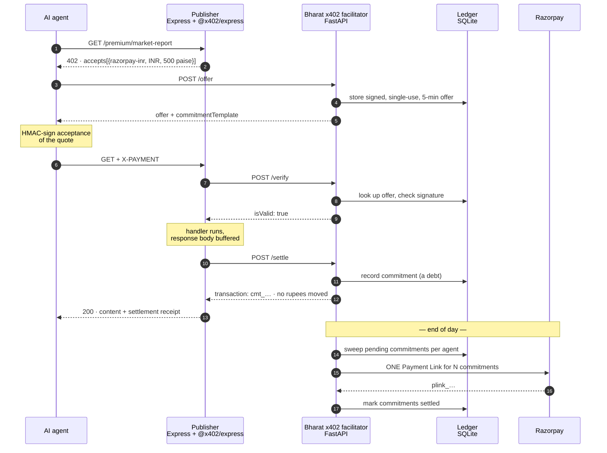
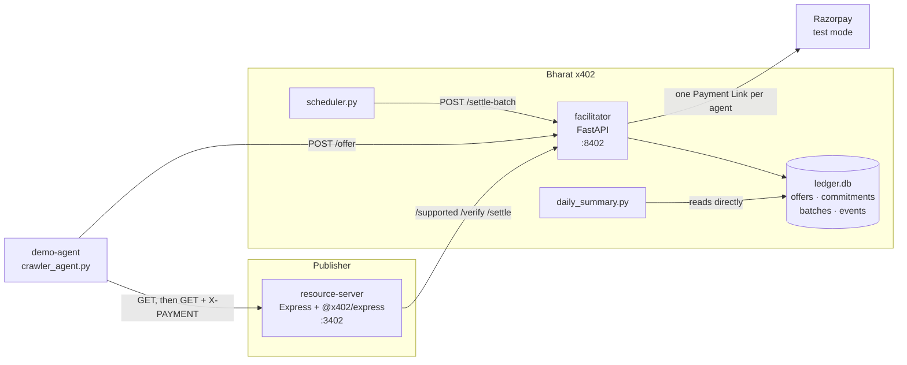

# Architecture

## The problem

Cloudflare's x402 protocol lets an AI agent pay per request for gated content, using
HTTP 402 and a payment proof in a header. It works, and its reference implementation
settles USDC on an EVM chain. For an Indian publisher that is the wrong currency, the
wrong rail, and a compliance question they did not ask for — so the practical answer to
"can Indian publishers monetise AI crawler traffic with x402?" has been *not without
stablecoin infrastructure*. Meanwhile agent traffic to Indian sites keeps growing and
none of it pays.

x402 is explicitly facilitator-agnostic: any service that can verify a payment payload
and settle it can act as a facilitator. **Bharat x402 is that service, for rupees.** It
speaks the real x402 facilitator contract, so a publisher runs the stock `@x402/express`
middleware unmodified and gets paid in INR through Razorpay.

The interesting problem turned out not to be the protocol. It was the economics, and
that is what most of this design is about.

---

## The flow



The publisher's handler contains no payment code. By the time Express reaches it, the
middleware has already verified payment; if settlement then fails, the buffered response
is discarded and the agent gets a 402 instead of the content.

---

## What is actually different from stock x402

Only three things, and all three are documented extension points rather than
modifications:

| Seam | Reference stack | Bharat x402 |
| --- | --- | --- |
| **Network** | `eip155:8453` (Base) | `razorpay:inr-test` — `Network` is typed `` `${string}:${string}` ``; nothing requires a blockchain |
| **Scheme** | `exact` — EIP-3009 signature | `razorpay-inr` — registered via `register(network, scheme)` |
| **Facilitator** | `x402.org/facilitator` | our FastAPI service, over the standard `/supported` + `/verify` + `/settle` contract |

Everything else — the 402 response shape, header handling, the verify → run handler →
settle ordering — is the stock library doing its normal job.

### Money representation

Amounts travel as **integer paise**, mirroring how USDC travels in atomic 1e-6 units.
₹5.00 is the string `"500"`. No float touches a monetary value anywhere: `BigInt` in the
JavaScript price parser, `int` in Python, `INTEGER` columns in SQLite.

### One thing stock x402 has no equivalent for

An agent paying in USDC holds a wallet and can construct a signed transfer authorisation
unaided. An agent paying in rupees has no such instrument — there is no "sign a rupee
transfer" primitive. So the flow adds a quoting step: the agent asks the facilitator for
a signed offer and signs its *acceptance* of that offer.

The offer is bound to one agent, one resource, and one amount; it expires; and it can be
spent exactly once, enforced by a `UNIQUE` constraint on `offer_id` in the commitments
table rather than by application logic.

---

## Why deferred settlement, honestly

The tempting claim is that batching slashes gateway fees. **On a pure percentage fee it
does not**, and anyone who works in payments will spot that instantly: 2% of a hundred ₹5
charges is 2% of one ₹500 charge. An earlier version of the cost model in this repo
reported a saving that turned out to be a rounding artifact. It was removed, and there is
now a test (`test_percentage_fees_are_neutral_to_batching`) pinning the honest version so
it cannot creep back.

The real barriers to per-request INR settlement, in order of how much they bite:

**1. The gateway minimum.** Razorpay will not process an order below ₹1.00. A ₹0.50 API
call is not *expensive* to settle individually — it is *impossible*. Sub-rupee is exactly
where agent API pricing wants to sit, so batching is not an optimisation here. It is what
makes the price point exist at all.

**2. Checkout has a human in it.** A Payment Link is a hosted page somebody opens and
pays on. That cannot sit in the path of an HTTP request an agent makes ten thousand times
a day, at any fee. One charge per agent per day is a shape that works; one per request is
not.

**3. Fixed per-transaction cost multiplies by N.** So does operational cost: N webhooks,
N reconciliation rows, N line items in a dispute report. `FeeModel.fixed_paise` models
the first; the second is real engineering time that no fee schedule shows.

**4. Percentage fees.** Genuinely neutral. Reported by the cost model for completeness,
not as the argument.

### Measured

60 agent fetches at ₹0.50, settled by `scheduler.py --once`:

```
60 requests · ₹30.00 committed · 5 agents
settled into 5 Payment Links, one per agent
₹30.00 of ₹30.00 unreachable per-request — all 60 charges under the ₹1.00 floor
```

The headline is not a fee percentage. It is that **the revenue exists at all.**

---

## Why this matters for Razorpay

Three things this points at, beyond the demo:

**Agent traffic is a payments category that does not have a rail yet.** The volume is
real and growing, the per-transaction values are far below anything the card/UPI
economics were designed for, and nobody is collecting it. The gap is not authorisation —
it is aggregation. Something has to hold a running tab and settle it periodically, which
is a payments-company problem rather than a publisher problem.

**UPI Autopay is the natural end state, and this shape is already compatible with it.**
Payment Links are used here because they are the simplest thing that demonstrably works
in test mode. The commitment ledger does not care what settles it — swapping the batch
charge for a mandate debit touches `razorpay_client.py` and nothing else. An agent
operator with a mandate is a far better fit than a hosted checkout page nobody opens.

**Deferred settlement is a facilitator product, not a publisher feature.** Every
publisher who wants this needs the same ledger, the same batching, the same reporting.
That is infrastructure — the kind a payments company provides and a newspaper should
never have to build. Razorpay's Agent Studio already delivers merchant reports over
WhatsApp; `reporting/daily_summary.py` renders in that shape deliberately.

---

## Component layout



The reporting script reads SQLite directly rather than through the facilitator's API, so
a publisher's revenue report still works when the facilitator is down.

---

## Simplifications, and what production would change

Flagged rather than buried, because the difference between a demo and a payment system is
mostly this list.

| Area | Here | Production |
| --- | --- | --- |
| **Payment proofs** | HMAC-SHA256 with a secret shared by agent, publisher, and facilitator | Per-agent keypair (Ed25519 for a non-EVM rail). The current scheme has **no non-repudiation** — the facilitator holds the key it verifies with, so it could forge any agent's commitment. A disputed charge cannot be adjudicated from the proof. Only `payment_verifier.py` changes. |
| **Settlement instrument** | One-off Payment Link per agent per day | UPI Autopay mandate, debited automatically. Removes the human from the loop entirely. |
| **Agent identity** | A self-asserted string | Registered agent credentials, rate limits, per-agent spending caps |
| **`payTo`** | Opaque string | Validated Razorpay account, with a real publisher onboarding flow |
| **Ledger** | SQLite, single writer behind a lock | Postgres, with the commitment table partitioned by settlement date |
| **Batch failure** | Commitments stay pending, retried next run | Dead-letter queue, alerting, partial-batch recovery, reconciliation against Razorpay's own records |
| **Replay protection** | Single-use offers with expiry | Same, plus a distributed nonce cache so multiple facilitator instances agree |
| **Razorpay calls** | Exercised in mock mode only | Verified against test keys, then live, with webhook handling for payment status |
| **Secrets** | `.env` files | A secret manager; the HMAC secret becomes per-agent public keys and stops being a secret at all |

### Deliberately kept, not simplified

- Constant-time signature comparison (`hmac.compare_digest`), so verification cannot be timed.
- Canonical JSON serialisation, so the same logical object always signs identical bytes.
- Integer paise end to end.
- Idempotent settlement — a retried `/settle` returns the original commitment.
- A hard refusal to start on an `rzp_live_` key, not overridable by config.
- Structured audit logging of every rejection with a distinct reason code.
- Fail-closed paywalling: if settlement is unavailable the resource server returns 503, never the content.
