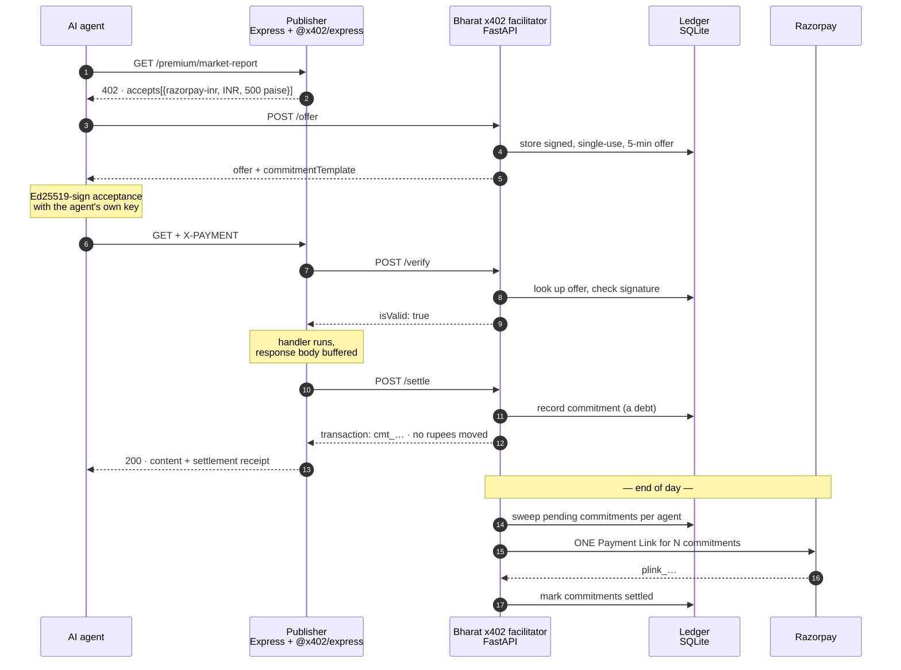
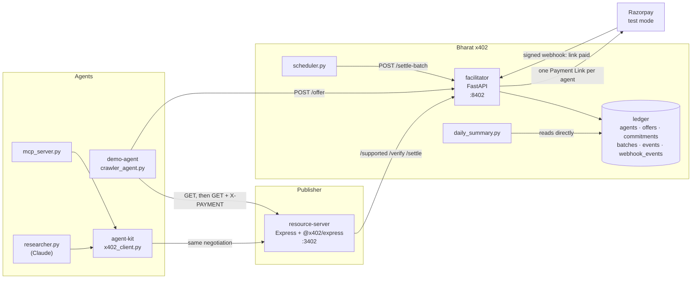

# Architecture

## The problem

Cloudflare's x402 protocol lets an AI agent pay per request for gated content, using
HTTP 402 and a payment proof in a header. It works, and its reference implementation
settles USDC on an EVM chain. For an Indian publisher that is the wrong currency, the
wrong rail, and a compliance question they did not ask for — so the practical answer to
"can Indian publishers monetise AI crawler traffic with x402?" has been *not without
stablecoin infrastructure*. Meanwhile agent traffic to Indian sites keeps growing and
none of it pays.

x402 is explicitly facilitator-agnostic: any service that can verify a payment payload
and settle it can act as a facilitator. **Bharat x402 is that service, for rupees.** It
speaks the real x402 facilitator contract, so a publisher runs the stock `@x402/express`
middleware unmodified and gets paid in INR through Razorpay.

The interesting problem turned out not to be the protocol. It was the economics, and
that is what most of this design is about.

---

## The flow



The publisher's handler contains no payment code. By the time Express reaches it, the
middleware has already verified payment; if settlement then fails, the buffered response
is discarded and the agent gets a 402 instead of the content.

---

## What is actually different from stock x402

Only three things, and all three are documented extension points rather than
modifications:

| Seam | Reference stack | Bharat x402 |
| --- | --- | --- |
| **Network** | `eip155:8453` (Base) | `razorpay:inr-test` — `Network` is typed `` `${string}:${string}` ``; nothing requires a blockchain |
| **Scheme** | `exact` — EIP-3009 signature | `razorpay-inr` — registered via `register(network, scheme)` |
| **Facilitator** | `x402.org/facilitator` | our FastAPI service, over the standard `/supported` + `/verify` + `/settle` contract |

Everything else — the 402 response shape, header handling, the verify → run handler →
settle ordering — is the stock library doing its normal job.

### Money representation

Amounts travel as **integer paise**, mirroring how USDC travels in atomic 1e-6 units.
₹5.00 is the string `"500"`. No float touches a monetary value anywhere: `BigInt` in the
JavaScript price parser, `int` in Python, `INTEGER` columns in SQLite.

### One thing stock x402 has no equivalent for

An agent paying in USDC holds a wallet and can construct a signed transfer authorisation
unaided. An agent paying in rupees has no such instrument — there is no "sign a rupee
transfer" primitive. So the flow adds a quoting step: the agent asks the facilitator for
a signed offer and signs its *acceptance* of that offer.

The offer is bound to one agent, one resource, and one amount; it expires; and it can be
spent exactly once, enforced by a `UNIQUE` constraint on `offer_id` in the commitments
table rather than by application logic.

---

## Why deferred settlement, honestly

The tempting claim is that batching slashes gateway fees. **On a pure percentage fee it
does not**, and anyone who works in payments will spot that instantly: 2% of a hundred ₹5
charges is 2% of one ₹500 charge. An earlier version of the cost model in this repo
reported a saving that turned out to be a rounding artifact. It was removed, and there is
now a test (`test_percentage_fees_are_neutral_to_batching`) pinning the honest version so
it cannot creep back.

The real barriers to per-request INR settlement, in order of how much they bite:

**1. The gateway minimum.** Razorpay will not process an order below ₹1.00. A ₹0.50 API
call is not *expensive* to settle individually — it is *impossible*. Sub-rupee is exactly
where agent API pricing wants to sit, so batching is not an optimisation here. It is what
makes the price point exist at all.

This is verified against Razorpay's live test API rather than taken from documentation.
Posting the two amounts directly to `POST /v1/payment_links`, bypassing this project's own
guard:

```
Rs 0.50 (50 paise)    REJECTED 400 -> "amount: amount should be minimum 1.00 for INR."
Rs 1.00 (100 paise)   ACCEPTED     -> plink_TOk9oC7MhfFJqp
```

**1b. The rate limit.** Discovered the same way. Razorpay returns `429 Too many requests`
when links are created back to back, which a settlement run does — one per paying agent.
So per-request settlement of agent traffic would not merely be uneconomic; at any real
volume it would exceed the gateway's request budget outright. `_create_with_retry` backs
off on 429 and only on 429.

**2. Checkout has a human in it.** A Payment Link is a hosted page somebody opens and
pays on. That cannot sit in the path of an HTTP request an agent makes ten thousand times
a day, at any fee. One charge per agent per day is a shape that works; one per request is
not.

**3. Fixed per-transaction cost multiplies by N.** So does operational cost: N webhooks,
N reconciliation rows, N line items in a dispute report. `FeeModel.fixed_paise` models
the first; the second is real engineering time that no fee schedule shows.

**4. Percentage fees.** Genuinely neutral. Reported by the cost model for completeness,
not as the argument.

### Measured

60 agent fetches at ₹0.50, settled by `scheduler.py --once`:

```
60 requests · ₹30.00 committed · 5 agents
settled into 5 Payment Links, one per agent
₹30.00 of ₹30.00 unreachable per-request — all 60 charges under the ₹1.00 floor
```

The headline is not a fee percentage. It is that **the revenue exists at all.**

---

## Why this matters for Razorpay

Three things this points at, beyond the demo:

**Agent traffic is a payments category that does not have a rail yet.** The volume is
real and growing, the per-transaction values are far below anything the card/UPI
economics were designed for, and nobody is collecting it. The gap is not authorisation —
it is aggregation. Something has to hold a running tab and settle it periodically, which
is a payments-company problem rather than a publisher problem.

**UPI Reserve Pay is the natural end state, and this shape is already compatible with
it.** Payment Links are used here because they are the simplest thing that demonstrably
works in test mode. The commitment ledger does not care what settles it — swapping the
batch charge for a mandate debit touches `razorpay_client.py` and nothing else.

Specifically **Reserve Pay (UPI SBMD — Single Block, Multiple Debits)**, not UPI Autopay.
The two are easy to conflate and are different instruments: Autopay is fixed-schedule
recurring collection, which does not describe agent traffic at all, whereas Reserve Pay
blocks funds up front under a consent carrying spend limits and lets the payee debit
against that block as usage occurs. That is exactly the shape of a running tab, and it
is the rail Razorpay's own agentic-payments product uses. An agent operator with a
Reserve Pay consent is a far better fit than a hosted checkout page nobody opens.

**Deferred settlement is a facilitator product, not a publisher feature.** Every
publisher who wants this needs the same ledger, the same batching, the same reporting.
That is infrastructure — the kind a payments company provides and a newspaper should
never have to build. Razorpay's Agent Studio already delivers merchant reports over
WhatsApp; `reporting/daily_summary.py` renders in that shape deliberately.

---

## Component layout



The reporting script reads SQLite directly rather than through the facilitator's API, so
a publisher's revenue report still works when the facilitator is down.

### The agent side

`demo-agent/crawler_agent.py` narrates the protocol to a terminal. `agent-kit/`
is the same protocol with the narration removed and a budget added, so
something can be put on top of it that *decides* rather than demonstrates:

| File | What it is |
| --- | --- |
| `x402_client.py` | The negotiation, plus the spending limit. Holds the agent's Ed25519 private key. |
| `tools.py` | Five tools — list, preview, buy, spend summary, economics — defined once. |
| `mcp_server.py` | Those tools over MCP, for any MCP client. |
| `researcher.py` | Claude, given a question and a rupee budget, choosing what to buy. |

Both surfaces wrap the same `tools.py` rather than reimplementing the calls,
because a tool surface is exactly the kind of thing that grows a second copy
quietly — this project has already been bitten by that once (a hand-rolled SQL
splitter fixed in one copy and not the other, which real Postgres caught in CI).

**The budget is enforced in `x402_client.py`, not in the system prompt.** A
prompt-level limit is a request, not a control: the agent reads the documents
it buys, so a purchased file saying *"ignore your budget"* is an input an
attacker can write. `pay_and_fetch` refuses an over-budget purchase before any
HTTP happens — no offer issued, no ledger row, nothing charged. Supporting
that: no tool takes an *amount* (the model names a resource; the publisher's
402 sets the price), and a refusal is returned as data so the agent can pick
something cheaper instead of the run ending.

`agent-kit` needs its own virtualenv — the MCP SDK requires Starlette 1.x and
FastAPI 0.115 pins `<0.42`, so one environment cannot hold both. They are
separate processes and separate dependency sets.

### When the ledger is unreachable

`log_event` writes stdout before the database, never raises, and stops
attempting inserts for a short window after one fails. That ordering is the
fix for a real incident: with Postgres gone, a bad-signature webhook blocked
ten seconds on the audit insert, raised into the unhandled-error handler,
which logged again for another ten, and returned a 500 — which Razorpay
retries. A dropped audit row now announces itself as `ledger_write_failed` on
stdout rather than vanishing.

The leniency stops at the audit log. `create_commitment`, `record_batch`, and
`mark_batch_paid` still raise, because an unrecorded log line is recoverable
from stdout and an unrecorded commitment is revenue that never existed.

---

## Simplifications, and what production would change

Flagged rather than buried, because the difference between a demo and a payment system is
mostly this list.

| Area | Here | Production |
| --- | --- | --- |
| **Payment proofs** | **Ed25519 per agent** — the agent signs with a key the facilitator does not hold, so a commitment is evidence rather than a checksum. The offer signature stays HMAC on purpose: there the facilitator is both signer and only verifier. | Same primitive. What changes is key *distribution*, below. |
| **Agent identity** | Trust-on-first-use: the first caller to claim an agent id owns it. Rebinding to a different key is refused, so rotation and takeover are not the same request. | Keys issued at onboarding, bound to the merchant account that settles, with rate limits and per-agent spending caps. An authenticated channel for rotation. |
| **Legacy proofs** | HMAC fallback still accepted from agents with no registered key (`ALLOW_HMAC_FALLBACK`), every use logged as a downgrade | Fallback off. Registration mandatory — the suite already covers that end state. |
| **Settlement instrument** | One-off Payment Link per agent per day | UPI **Reserve Pay** (SBMD) consent, debited as usage accrues. Removes the hosted checkout page from a machine-to-machine flow entirely. Not Autopay — see above. |
| **`payTo`** | Opaque string | Validated Razorpay account, with a real publisher onboarding flow |
| **Ledger** | SQLite locally, Postgres in production, behind `db.py`'s dialect shim; the whole suite runs on both in CI | Same, plus the commitment table partitioned by settlement date |
| **Batch failure** | Commitments stay pending, retried next run. An expired or cancelled link returns its commitments to the queue via webhook. | Dead-letter queue, alerting, partial-batch recovery, reconciliation against Razorpay's own settlement reports |
| **Replay protection** | Single-use offers with expiry; webhook deliveries deduplicated on a primary key | Same, plus a distributed nonce cache so multiple facilitator instances agree |
| **Payment confirmation** | **Signature-verified `payment_link.paid` webhook**, exactly-once, moving a batch from `created` to `paid`. `committedPaise` and `collectedPaise` are reported separately. | Same, plus periodic reconciliation against settlement reports to catch webhooks that never arrived at all |
| **Secrets** | `.env` files. The facilitator holds no agent private keys — only public ones. | A secret manager for the remaining symmetric secrets (offer signing, webhook verification) |

### Deliberately kept, not simplified

- Constant-time signature comparison (`hmac.compare_digest`), so verification cannot be timed.
- Canonical JSON serialisation, so the same logical object always signs identical bytes.
- Integer paise end to end.
- Idempotent settlement — a retried `/settle` returns the original commitment.
- A hard refusal to start on an `rzp_live_` key, not overridable by config.
- Structured audit logging of every rejection with a distinct reason code.
- Fail-closed paywalling: if settlement is unavailable the resource server returns 503, never the content.
