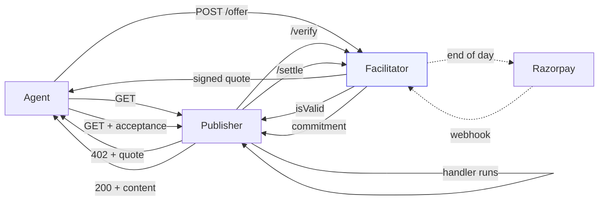
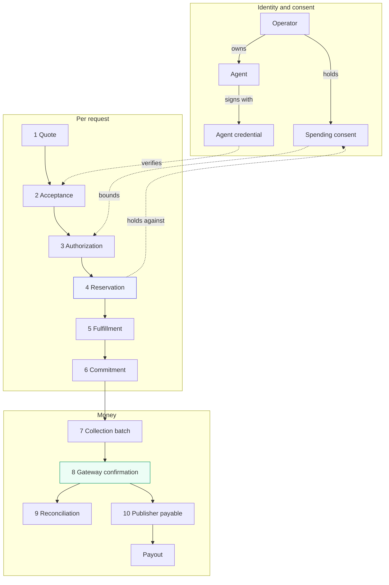
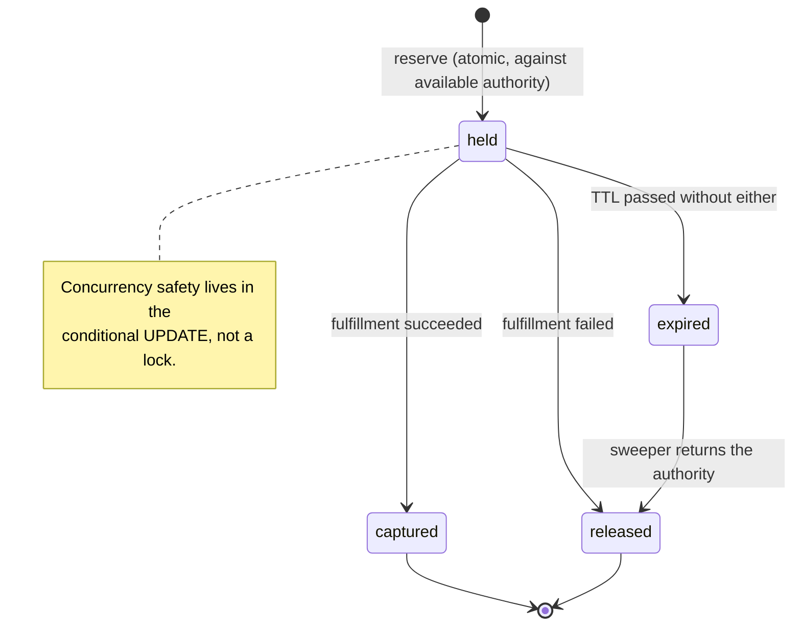
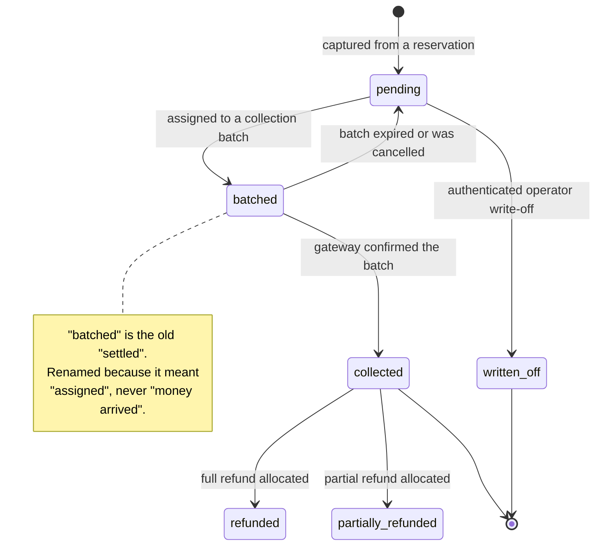
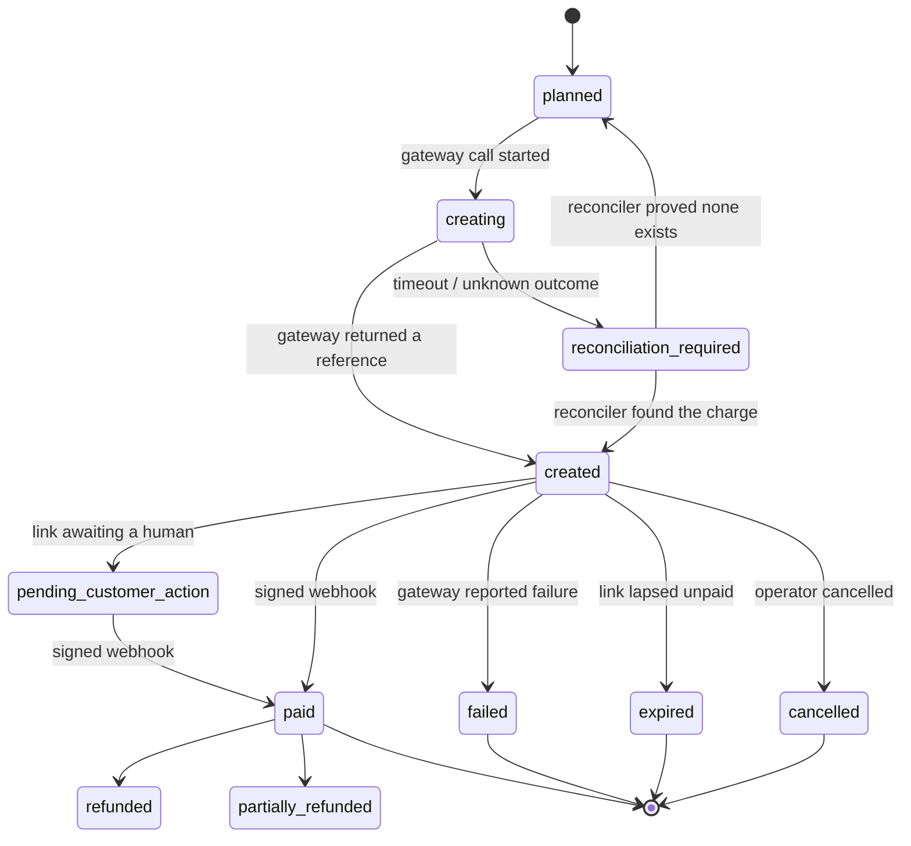
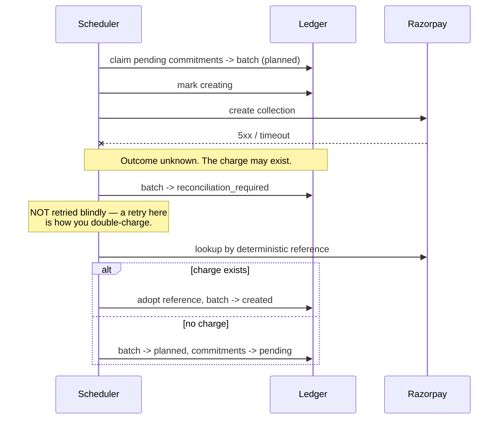
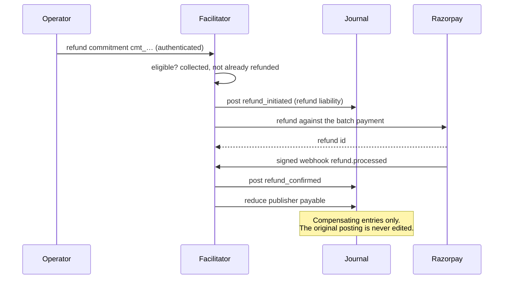
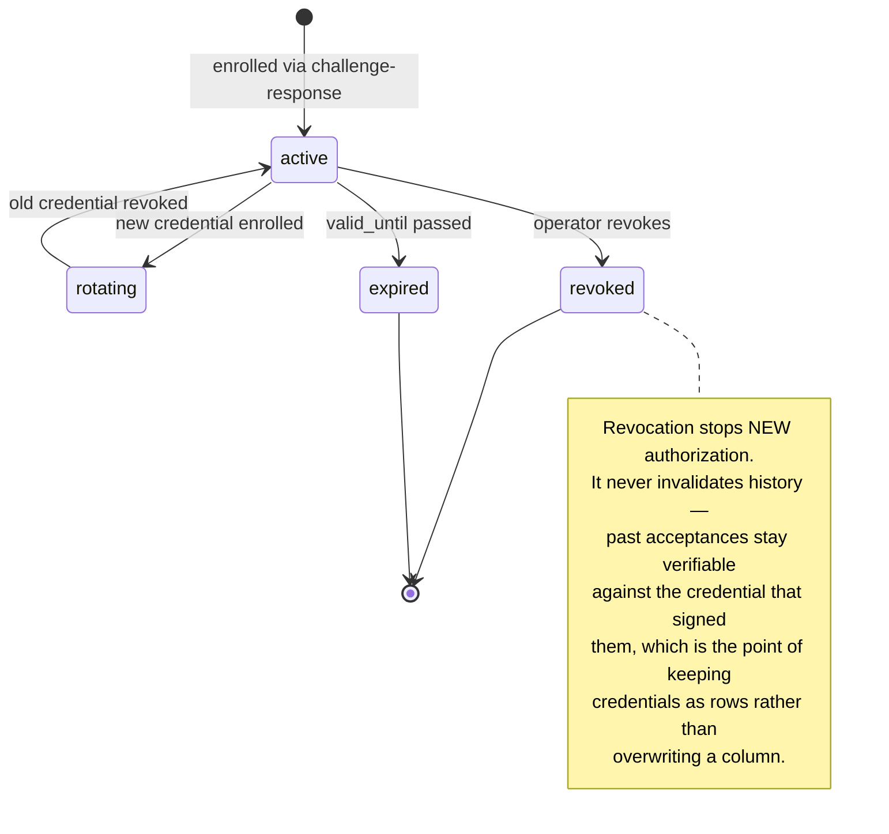

# Domain model

The vocabulary this project uses, why each term exists, and the state machines behind them.

The whole reason this document exists is that "payment" is not one event. In a deferred,
aggregated system it is at least ten, and collapsing them into a single word labelled *paid* is
how a ledger ends up overstating revenue. Every term below names exactly one of those steps.

---

## Glossary

| Term | Means | Explicitly does **not** mean |
| --- | --- | --- |
| **Quote** | A priced offer for a specific resource, signed by the facilitator, single-use, time-limited | A payment, or a promise by anyone to pay |
| **Acceptance** | The agent key's Ed25519 signature over a quote | That funds exist, or that the signer is a known legal entity |
| **Authorization** | A decision that this request may proceed: consent is live, limits are unbreached, the merchant is in scope | That money moved |
| **Reservation** | An amount held against available authority, before the content is served | A debit. Nothing has left anyone's account |
| **Fulfillment** | The protected content was actually produced and delivered | Payment |
| **Commitment / receivable** | An amount owed after fulfillment, booked against an agent and settlement date | Cash. It is an asset, and assets go bad |
| **Collection** | An attempt to move money externally — creating a Payment Link, debiting a mandate | Receipt of money |
| **Gateway confirmation** | Signed webhook evidence, or a reconciled fetch, that the gateway believes a collection succeeded | Funds settled into a bank account |
| **Publisher payable** | Net collected value owed to a publisher | Money already sent to them |
| **Payout** | Actual transfer of payable value to the publisher | — |
| **Reconciliation** | Systematic comparison of internal records against gateway records, with classified discrepancies | — |

### Two words this project refuses to use loosely

- **"Paid."** Reserved for gateway-confirmed collection. An agent that has fetched content has
  *committed*, not paid.
- **"Revenue."** Reserved for collected value. Accrued receivables are reported as **accrued**,
  and the difference is reported as **outstanding**.

---

## The ten concerns, and where each lives

| # | Concern | Where it is decided | Where it is recorded |
| --- | --- | --- | --- |
| 1 | Price negotiation | `resource-server/x402-config.js` → `POST /offer` | `offers` |
| 2 | Agent identity | `payment_verifier.verify_payment_proof` | `agents`, `agent_credentials` |
| 3 | Operator consent & payment authority | `authority.py` | `operators`, `spending_consents` |
| 4 | Usage authorization | `POST /verify` + reservation | `reservations` |
| 5 | Content fulfillment | The publisher's own handler | — (the 200 itself) |
| 6 | Receivable accrual | `POST /settle` | `commitments` |
| 7 | Aggregate collection | `POST /settle-batch`, `scheduler.py` | `batches` |
| 8 | Gateway confirmation | `webhooks.py` | `batches.status`, `webhook_events` |
| 9 | Reconciliation | *Phase 5* | *Phase 5* |
| 10 | Publisher payable / payout | `journal` accounts | `journal_entries` |

---

## Current flow (before this work)



**What is missing.** Nothing between "a key signed something" and "serve the content". The agent's
authority to spend is never checked, because there is nobody it is spending *on behalf of*. A
pseudonymous key promises to pay, and that promise is the only thing standing behind the content
that gets served.

## Target flow



The change that matters is **step 4**. Content is no longer released against a promise; it is
released against authority that has been *reserved* and can be shown to exist.

---

## State machines

### Reservation



### Commitment (receivable)



### Collection batch



### Collection failure



### Refund



### Key revocation



### Lost webhook, repaired by reconciliation

```mermaid
sequenceDiagram
    participant R as Razorpay
    participant F as Facilitator
    participant C as Reconciler

    F->>R: create collection
    R-->>F: reference
    Note over R,F: Customer pays. Webhook is<br/>dispatched and lost.
    Note over F: Batch is still "created".<br/>Money arrived; we do not know.
    C->>R: fetch state by reference
    R-->>C: status paid, amount, payment id
    C->>C: classify discrepancy = missing_webhook
    C->>F: repair — apply the same transition<br/>the webhook would have
    Note over F: Idempotent: if the webhook<br/>later arrives, the dedupe key<br/>makes it a no-op.
```

---

## Why "settled" was the wrong word

`commitments.status = 'settled'` meant *assigned to a batch*. It is the word a reader is most
likely to take as "money arrived", and it sat in the same table as the amount owed. Phase 4 renames
the concept to **batched**, keeps the old value readable for existing rows, and reserves
**collected** for gateway-confirmed money.

`POST /settle` keeps its name, because it is the x402 facilitator contract and renaming it would
break the stock middleware. What it *does* in this scheme — record a receivable, move no money — is
documented in [protocol-extension.md](protocol-extension.md) and advertised as a machine-readable
extension on `/supported`.
