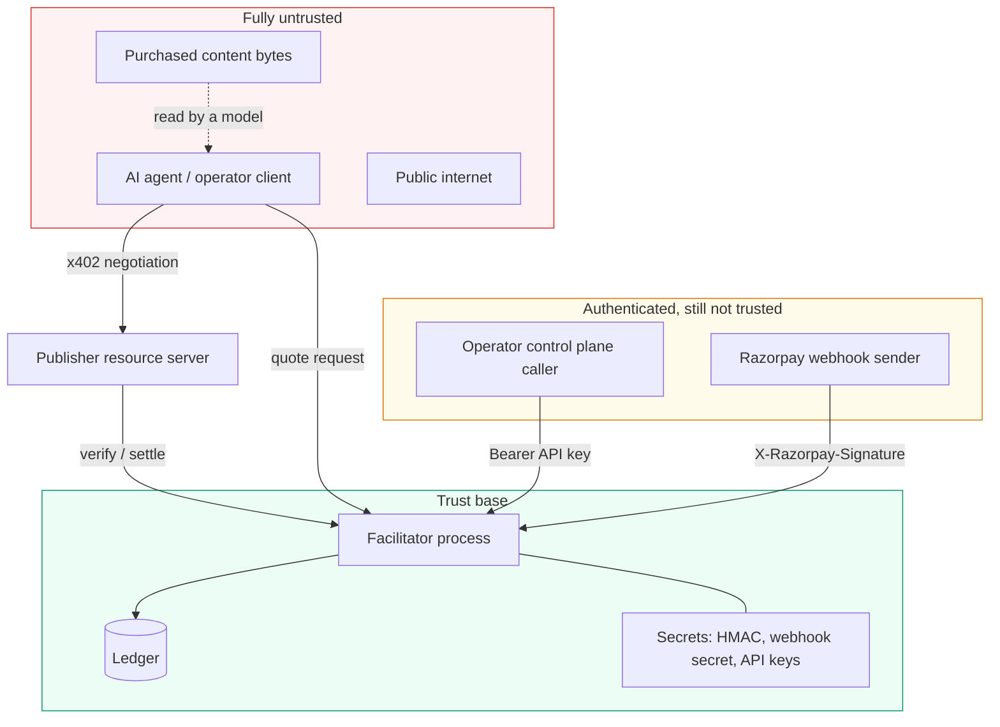

# Threat model

Scope: the facilitator, the publisher's resource server, the agent kit, and the data flowing
between them. Test mode only — no live credentials, no real money.

---

## Trust boundaries

The publisher sits deliberately outside the trust base. It is a customer of the facilitator, not
part of it, and the facilitator re-verifies every proof rather than trusting that the middleware
already did.

---

## Assets

| Asset | Why an attacker wants it | Worst case |
| --- | --- | --- |
| Agent signing private keys | Impersonate an agent and spend its consent | Fraudulent charges attributed to a real operator |
| Operator API keys | Full control-plane access to a tenant | Read every ledger row, raise limits, write off debt |
| Facilitator HMAC secret | Forge quotes | Mint priced offers the ledger will honour |
| Razorpay webhook secret | Forge collection confirmations | Mark uncollected batches as paid — revenue fabricated |
| Razorpay API credentials | Create charges | Test mode only, but rate-limit and reputational damage |
| Ledger contents | Commercial intelligence | Competitor learns a publisher's agent revenue and pricing |
| The `LEDGER_DSN` | Direct database access | Total compromise |

---

## Threats and controls

Ordered by how much damage a success would do.

### T1 — Forged collection confirmation

*An attacker POSTs a fabricated `payment_link.paid` webhook and marks batches collected.*

- HMAC-SHA256 over the **raw** request body, per Razorpay's documented scheme.
- **Fails closed**: with no `RAZORPAY_WEBHOOK_SECRET` configured, every delivery is refused —
  never "trust everything because the env var is missing".
- The body is read as bytes *before* any parsing. Parsing before verifying is the classic bug.
- Constant-time comparison.
- The webhook is not authoritative for the amount: it confirms a batch we already created and
  whose total we already computed.

**Residual.** A leaked webhook secret is a full revenue-fabrication primitive. Rotation is manual.

### T2 — Facilitator forges an agent's acceptance

*The party adjudicating a dispute is also the party that could have written the evidence.*

- Ed25519. The facilitator stores **only public keys** and structurally cannot sign.
- This is the reason the acceptance is not an HMAC, and it is the one guarantee here that is
  genuinely cryptographic rather than procedural.

### T3 — Algorithm downgrade

*An attacker presents an HMAC proof for an agent that has a registered Ed25519 key.*

- The **facilitator** selects the algorithm from what it has on record. The payload never names it.
- The key is looked up by the agent id on the **stored offer**, never the payload's — otherwise an
  attacker relabels itself as an unregistered agent to reach the weaker path deliberately.
- HMAC fallback is **off** in the production-like profile and every fallback verification is logged
  as a downgrade.
- Tested in `tests/test_agent_keys.py`.

### T4 — Identity claiming (trust-on-first-use)

*Anyone binds a key to a valuable agent id, because the first caller wins.*

- Phase 2: agent enrollment requires an **authenticated operator** and a challenge-response,
  proving possession of the private key against a server-issued nonce.
- TOFU survives only behind `DEMO_UNSAFE_TOFU`, which is off by default and logs a startup warning.
- Rebinding an existing id is refused regardless, so takeover and rotation are never the same
  request.

**Residual.** Nothing binds an operator to a legal entity. There is no KYC here.

### T5 — Cross-tenant data access

*One operator reads another's ledger, economics, or audit trail.*

- Before Phase 2 this was **unconditionally true**: every operational endpoint was public and
  `agentId` was a filter, not an authorization.
- Phase 2 scopes every control-plane endpoint to the caller's tenant, resolved from the API key —
  never from a query parameter.
- Tenant-isolation tests cover each endpoint.

### T6 — Double spend / double charge

*One quote yields two commitments, or one batch is collected twice.*

- Conditional `UPDATE ... WHERE status = 'open'` — only one of two concurrent settlements wins.
- `UNIQUE(offer_id)` as the database-level backstop.
- Webhook exactly-once by primary-key claim, not read-then-check.
- No process-local lock is load-bearing; the deployment is serverless and shares nothing.
- Verified on real Postgres, not only SQLite.

### T7 — Overspending authority

*Concurrent requests each pass a limit check and jointly exceed it.*

- The cap is evaluated **inside the write** (`INSERT ... SELECT ... WHERE <cap>`), never
  read-then-decide.
- Phase 3 extends the same discipline to reservations against `authority_accounts`.
- A test makes the pre-read lie and confirms the statement still refuses.

### T8 — Prompt injection through purchased content

*An agent buys a document that instructs it to ignore its budget.*

- The budget is enforced in `X402Client.pay_and_fetch`, **before any HTTP happens** — it is code,
  not a sentence in a system prompt.
- **No tool accepts an amount.** The model names a *resource*; the price comes from the publisher's
  402 and the signature is produced behind the tool boundary by a key that never crosses it.
- A refusal is returned as *data*, so the agent picks something cheaper instead of crashing.
- Purchased content is never treated as instructions, and is not logged wholesale.

### T9 — Credential disclosure through logs or errors

*A DSN, key, or secret escapes in an error message or an HTTP response.*

- `redact_credentials()` strips `user:password@` from any connection URL, applied at **both** the
  driver boundary and the HTTP boundary — one is a behaviour, two is an invariant.
- A test asserts the HMAC secret never appears in a `/demo/run` response or error.
- API keys are stored as hashes; the plaintext is shown once at issuance and never again.

**Residual.** Third-party driver exceptions are the likeliest leak path and are only as safe as the
redaction regex.

### T10 — Denial of service / resource exhaustion

*Quote flooding, or a public endpoint that writes ledger rows on demand.*

- `AGENT_OFFER_RATE_PER_MINUTE` caps quote issuance per agent.
- `/demo/run` caps `count` and throttles per session.
- `ACCEPT_PAYMENTS=false` is a global stop.
- The freeze control is an **environment variable, not an endpoint** — an unauthenticated
  `POST /agents/{id}/freeze` would be a denial-of-service primitive, strictly worse than no
  endpoint at all. Phase 2's authenticated control plane is what makes an endpoint safe here.

### T11 — Replay

*A quote or acceptance is presented twice, or a week later.*

- Quotes are single-use (`UNIQUE(offer_id)`), time-limited, and carry a nonce.
- Canonical JSON serialisation, so the same logical object always signs the same bytes.

### T12 — Ledger unavailability treated as success

*The database is down and the system keeps serving content.*

- `/health` probes the ledger with `SELECT 1` and returns **503**, not 200-with-a-sad-field.
- Audit writes use a short circuit breaker and **never raise** — but they log to stdout *before*
  the database, so an outage loses durability, not the trail.
- A facilitator that cannot book a commitment refuses the payment rather than serving on credit it
  cannot record.

---

## Secret inventory

| Secret | Where it lives | Reaches the browser? | Rotation |
| --- | --- | --- | --- |
| `X402_HMAC_SECRET` | Facilitator env only | **No** | Manual; invalidates open quotes |
| `RAZORPAY_WEBHOOK_SECRET` | Facilitator env only | No | Manual; Razorpay requires the old secret for in-flight retries |
| `RAZORPAY_KEY_SECRET` | Facilitator env only | No | Via Razorpay dashboard |
| `LEDGER_DSN` | Facilitator env only | No — redacted in `/health` | Via the database provider |
| Operator API keys | **Hash** in `api_credentials`; plaintext shown once at issue | Only to the operator that created it | `POST /control/keys/{id}/rotate` |
| Agent private keys | The agent's own process; `.keys/` is gitignored | No | Enroll a new credential, revoke the old |
| Agent public keys | `agent_credentials` | Yes, deliberately — the console verifies signatures against them | — |

The HMAC secret exists in **exactly one deployed service** and never reaches the browser. That is
checked by a test, not assumed.

---

## Out of scope

- Physical and cloud-provider security.
- Denial of service at the network layer.
- Malicious publisher code (the publisher is a customer, and is not trusted for verification, but
  its own handler is its own problem).
- Real-money fraud, chargebacks, and AML — this is test mode, and those need a licensed entity.
- Regulatory compliance for aggregating collections on behalf of publishers. See
  [product-proposal.md](product-proposal.md).
